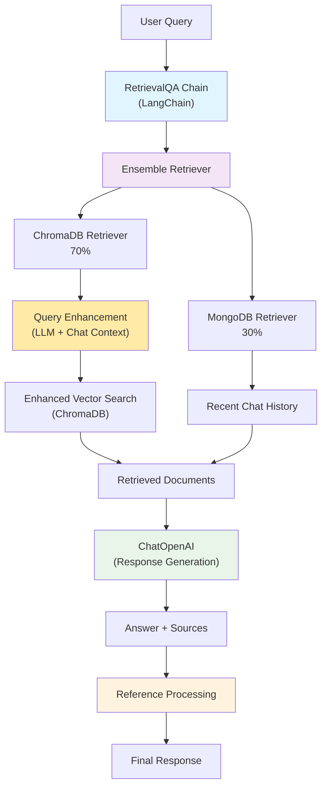

# AI Customer Support Bot

AI-powered customer support bot built with FastAPI and LangChain, featuring document retrieval and conversation management.

## Features

- AI-powered responses using OpenAI GPT
- Hybrid retrieval system (ChromaDB + MongoDB)
- Chat history storage and context awareness
- Reference filtering with relevance checking

## Tech Stack

- FastAPI (Python 3.10+)
- OpenAI GPT, LangChain
- ChromaDB (Vector Database)
- MongoDB (Document Storage)

## Setup

### Prerequisites
- Docker & Docker Compose
- OpenAI API key

### Local Development

1. Clone the repository:
   ```bash
   git clone <repository-url>
   cd AI-Customer-Support-bot
   ```

2. Create `.env` file:
   ```env
   OPENAI_API_KEY=your_openai_api_key_here
   ```

3. Run with Docker Compose:
   ```bash
   docker-compose up --build
   ```

API available at `http://localhost:8000`

## API

**Main Endpoint**: `POST /chat` - Send questions and receive AI responses with references

**Full API Documentation**: `http://localhost:8000/docs`

## Usage Example

```bash
curl -X POST "http://localhost:8000/chat" \
  -H "Content-Type: application/json" \
  -d '{"question": "How do I reset my password?"}'
```

Response:
```json
{
  "answer": "To reset your password, please follow these steps...",
  "references": [
    {
      "title": "Password Reset Guide",
      "url": "https://example.com/password-reset"
    }
  ]
}
```

## Architecture



## Configuration

### Environment Variables

| Variable | Description | Required |
|----------|-------------|----------|
| `OPENAI_API_KEY` | OpenAI API key for GPT models | Yes |
| `MONGODB_URI` | MongoDB connection string | Yes |
| Other LangChain/ChromaDB configs | Various retrieval settings | No |

### Customization

- **Prompts**: Modify prompts in `app/prompts/` directory
- **Retrievers**: Adjust retrieval weights in `app/retrievers/ensemble_retriever.py`
- **Temperature**: Adjust AI creativity in `app/services/chatbot.py`


## License

This project is licensed under the MIT License - see the LICENSE file for details.

## Support

For support, please:
1. Check the API documentation at `/docs`
2. Review the chat history endpoint for debugging
3. Check application logs for error details
4. Open an issue on the repository

---

**Note**: Make sure to configure your OpenAI API key and MongoDB connection before running the application.